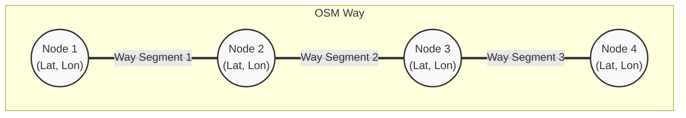

> Last things first: this is the revisionist history of a [PR fixing a multi-year-old bug in osmium-tool](https://github.com/osmcode/osmium-tool/pull/305), an open-source tool for working with OpenStreetMap (OSM) data.

> First things second: [osmium](https://github.com/osmcode/osmium-tool) is one of my favourite tools when I work with OSM data, along with the [JOSM editor](https://josm.openstreetmap.de/). I use osmium-tool for manipulating data and JOSM editor for visualizing and examining the data, ironically, never for editing.


## Background and Purpose
<!-- /img/nodes-ways.svg -->


We wanted to limit the use of ways that are strictly inside a given region.
A region is defined by one or more [simple polygons](https://en.wikipedia.org/wiki/Simple_polygon). 

Ways, on the other hand, have an obvious common-sense definition[^asphalt].
[^asphalt]: Nooo, it ain't the asphalt!

A way is a continuous curve along which things can move. But its formal definition in the OSM data structure doesn't perfectly align with our real-world, common-sense conceptualization of a road.

In OSM, the fundamental building blocks are **node**s: points (coordinates) in space with some additional data (e.g., tags).
A **way** is then defined as a finite sequence of these nodes, holding its own additional data (e.g., speed limits, access restrictions). 
For our purposes, we can informally refer to the direct line connecting two consecutive nodes as a **way segment**.


Because a single physical road might change properties halfway down the street (e.g., the speed limit drops, or lanes are added), OSM splits what we see as one continuous physical road into multiple separate _way_ entities.


As if this structural discrepancy wasn't enough, we needed to handle arbitrary geographic regions. A polygon boundary might cut right through the middle of an OSM way. 

Because OSM's standard `way` definitions weren't granular enough for our geometric needs, we couldn't just include or exclude entire ways. 

We could merely tolerate exclusions at the precision of a *way segment*. In short, we needed to isolate and extract all individual way segments that fall completely inside a given polygon.

## Enter [osmium-tool](https://github.com/osmcode/osmium-tool)
osmium-tool has a feature to _[create a geographical extract](https://osmcode.org/osmium-tool/manual.html#creating-geographic-extracts) of OSM data that only contains the data for a specific region_.
That's exactly what we wanted, right?\
Almost: inclusion of the roads that intersect the region boundary, and whether the nodes on such ways inside or outside the region are included, depends on the use case. 
osmium-tool provides 3 extraction strategies:

### simple
> When using the simple strategy, all nodes inside the specified region are included and all nodes that are outside the region are not included. All ways that have at least one node inside the region are included, but they might be missing some nodes, they are not reference-complete. 


<details>

<summary> Expand for complete_ways and smart strategies</summary>

### complete_ways
> When using the complete_ways strategy, all nodes inside the specified region as well as all nodes used by ways that are partially inside the specified region will be in the output.


### smart
When using the smart strategy, everything is done as in the complete_ways strategy, but multipolygon relations that have at least one node in the region will also be completely included.


</details>

The simple strategy sounds great for our needs.
Beware that it extracts nodes and ways, but we need to find way segments (consecutive node pairs that are part of those ways) inside the region. 
When we extract the region we are interested in with the simple strategy, it will give ways that intersect the region boundary, so some segments of those ways rest outside the region. So, we need to filter out those segments by checking if both of their nodes are inside the extraction as well.

## First Draft and Noticing the Problem
Its implementation was pretty straightforward.
Then we started testing it on multiple regions in random places.
Areas highlighted in red on the left side are the regions we want to examine/extract.
The points are the nodes and the lines are the way segments. 
Brown segments are all the segments we found in the regions (other segments are colored in orange, cyan, green, etc.):


Disappointingly, there were non-brown segments inside the region (even if both their nodes were inside the region).
First, I went over my implementation and found nothing suspicious. It was straightforward code, anyway.
Then I started examining the wrong segments to see if they had anything in common: same road type, same tags, etc. with the [JOSM editor](https://josm.openstreetmap.de/).
In fact, for a specific way whose multiple segments were inside the region, only a single segment was included.[^partial]

[^partial]: In retrospect we understood that this happened because we have two overlapping regions. The way was correctly included for one of them, but it was incorrectly excluded for the other one.

I was stuck: there was nothing in common for the wrong segments, my code seemed to correctly handle edge cases, and my logic, obviously, was sound.

I needed to check the state at every step to find where the code failed.

## Enter Cursor and Claude Sonnet | Opus
I decided that it was time I plead to the AI overlords!

> Last things first (one more time):
you can find an export of the Cursor session that I used for debugging and fixing the issue [here](/cursor_map_segment_speed_changes_within).
I will go over the steps below, but you can examine the export for the raw interaction.  
Also, beware that the export does not include the images, files, and code references that I added to context. Similarly, the interaction with the terminal and other tools are not included either.

I initiated the chat by sharing the [previous image that shows the error](/img/osmium-polygon-overlay.png). \
Instead of explicitly stating the issue, I explained what the colors, lines, etc. mean, what my intent was, and asked it to evaluate the result. \
By doing so, _I hoped to verify both that it understood my intention and that it really examined the image, not just slopping plausibly sounding success/mistakes with a gazillion buzzwords._

To my mild surprise, it did a really good job. 
It correctly explained my implementation and identified two issues:
> 1. **Some roads inside polygons appear to still be cyan** (normal speed) on the right side
> 2. **Some dark-gray roads seem to extend beyond** the polygon boundaries on the left

Well, the second one is incorrect, but I'll look over that.
It presented three reasonable root causes:
> 1. **Boundary segments excluded**: Road segments that cross the polygon edge (one node inside, one outside) are intentionally skipped by your current logic
> 2. **OSM way structure**: Long ways with sparse node density might have few segments fully contained within narrow polygon strips
> 3. **Node position vs line geometry**: A road segment might visually appear inside the polygon, but if either of its endpoint nodes is outside, it won't be affected

It followed up with clarification questions on what should be done for the boundary segments and what specific issue I wanted it to fix. My reply was to skip boundary segments and fix the unaffected way segments inside the polygons.

It made a plan for reproducing the issue and asked for IDs for the specific ways and nodes.

I prepared an OSM file for the region (so that it wouldn't waste time processing a full map), shared the IDs of a way segment and corresponding nodes that were clearly inside the red polygons, and the polygon coordinates.

It started with sanity checks to ensure that the nodes were inside the polygon.

Then I shared a list of way segments that our current implementation found.

It checked whether there was an issue with specific nodes and their neighbours:
> Node 5992278830: lon=30.7155, lat=36.9051 ✓ captured \
Node 36245618: lon=30.7161, lat=36.9051 ✗ NOT captured \
 \
 **CONFIRMED: All 4 nodes are geometrically INSIDE the polygon**, but only 2 were captured:
| Node | lon | lat | Inside Polygon | Captured |
|------|-----|-----|----------------|----------|
| 990339773 | 30.7162 | 36.9046 | ✓ | ✓ |
| 5992278830 | 30.7155 | 36.9051 | ✓ | ✓ |
| 4339961951 | 30.7161 | 36.9057 | ✓ | ✗ |
| 36245618 | 30.7161 | 36.9051 | ✓ | ✗ |
>
>This is a critical finding! The issue is NOT with the polygon geometry or the containment logic. _Something is wrong with the osmium extraction or the PBF file being used_.

I verified that the PBF file was correct. It then suspected that our polygon coordinates were counter-clockwise against the [RFC 7946 Spec](https://datatracker.ietf.org/doc/html/rfc7946#section-3.1.6), to no avail.

It made a plan to use custom node and way extraction logic instead, but I stopped it and asked it to focus on reproducing the issue.

After implementing and running the reproduction code, it found:
>**Surprising result!** osmium correctly extracts ALL 4 nodes from `debug.osm.pbf`! \
This means the issue is NOT with osmium. Let me now trace the full segment generation to find where the segments are being lost: \
**Found the issue!** Way 91747534 is NOT in the filtered PBF! \
The nodes (36245618, 5992278830) ARE inside the polygon, but the WAY that contains them is missing... so osmium's "simple" strategy should include it, but **it's NOT in the filtered output!** \
This is an osmium bug or edge case. Let me compare with ways that ARE included:

It continued thinking and running the reproduction, and finally came up with a strong hypothesis:
> **Major discovery!** osmium is missing **28 ways** that should be included!
>
> Let me check if there's a pattern - maybe osmium is only including ways that START inside the polygon:
>
> **ROOT CAUSE FOUND!**
> 
> | Category | Count |
> |----------|-------|
> | INCLUDED ways with first node INSIDE | 83 |
> | INCLUDED ways with first node OUTSIDE | 0 |
> | MISSING ways with first node INSIDE | 0 |
> | MISSING ways with first node OUTSIDE | 28 |
> 
> **osmium's "simple" strategy only includes ways where the FIRST node is inside the polygon!** Ways that start outside but enter the polygon are incorrectly skipped!

At this point, it started coming up with a workaround by using custom filters on top of other extraction methods. \
However, its hypothesis excited me and I wanted to find the root cause. I had previously cloned the osmium-tool repository to potentially add a new extraction method that fit our other use cases. I didn't complete it since I couldn't figure out how it should handle some edge cases; these were irrelevant to our use case but could be relevant to other people using osmium-tool. \
Anyway, due to this previous exposure, I knew exactly where to look for the issue: [src/extract/strategy_simple.cpp](https://github.com/osmcode/osmium-tool/blob/v1.18.0/src/extract/strategy_simple.cpp).

I hope at this point you're no longer naive enough to think that I, myself, read the code. I asked it to examine the code, aaaaand BINGO:
> Looking at the osmium-tool source code, I found **the bug**!
> 
> ```75:83:osmium-tool/src/extract/strategy_simple.cpp
>         void eway(extract_data* e, const osmium::Way& way) {
>             for (const auto& nr : way.nodes()) {
>                 if (e->node_ids.get(nr.positive_ref())) {
>                     e->write(way);
>                     e->way_ids.set(way.positive_id());
>                 }
>                 return;
>             }
>         }
> ```
> 
> **The `return;` on line 81 is OUTSIDE the `if` block but INSIDE the `for` > loop!**
> 
> This means:
> 1. It checks **only the FIRST node** of the way
> 2. If the first node is inside → write the way
> 3. Then it **immediately returns** without checking any other nodes!
> 
> The correct code should be:
> 
> ```cpp
> void eway(extract_data* e, const osmium::Way& way) {
>     for (const auto& nr : way.nodes()) {
>         if (e->node_ids.get(nr.positive_ref())) {
>             e->write(way);
>             e->way_ids.set(way.positive_id());
>             return;  // <-- Should be INSIDE the if block!
>         }
>     }
> }
> ```

I asked it to fix the code and prepare a minimal reproducible test case.

It completed the implementation and prepared the test cases. Then it went on to set up the C++ environment and run the tests.

I examined the tests, verified the test would've failed without the fix, and asked a few follow-up questions, etc. It really did a great job.\
Right away, I committed the changes to my fork and opened a [PR](https://github.com/osmcode/osmium-tool/pull/305) to the upstream repository. \
Two of the CI checks failed, but I verified that they were not related to the changes and informed the maintainers.
A few days later the PR was merged, and the fix was included in the next [release](https://github.com/osmcode/osmium-tool/releases/tag/v1.19.0).


## Conclusion and Reflections

I guess we all have heard how Cursor and LLMs help non-technical people create apps, quickly spin up beautiful landing pages, write compilers, etc. These are certainly impressive use cases, and they've received arguably deserved hype. 

However, when I reflect on how Cursor helped solve this issue, I can't help but notice that in this particular case, it didn't bring any extra technical expertise to the table. I already knew:
* **How to use `osmium-tool`**, as my original code was accurate based on the docs.
* **How to reproduce the issue**, as I isolated the problematic nodes, and prepared the specific OSM file.
* **Where the actual implementation was**, as I found and pointed Cursor to the exact C++ file.
On one hand, Cursor did not help me debug a problem that I couldn't already debug myself.
On the other hand, without Cursor, I would have just written my own extraction logic as a workaround and called it a day

In that case, my immediate problem would be solved, but I would never have learned the actual root cause, nor fixed it for everyone else using `osmium-tool`. It would have been a missed learning opportunity for me, and wasted hours (or buggy software) for other users. 

Cursor helped come up with hypotheses, quickly test them, and iterate until we found the exact problem at a reasonable time cost. In other words, Cursor made it feasible to debug the issue until we found the root cause and fixed it.

This reduction in time/effort makes a lot of other things feasible, too. I've started building internal tools that previously wouldn't have justified the effort unless a whole team was going to use them for years:
* Dashboards that give us precious insights into our data analysis, helping us identify major bugs and visualize how customizations affect route planning.
* Custom developer tools that save me a lot of time, like test data generators and [a visualizer to decode/encode Teltonika's Communication Protocol binary data](/html/teltonika_codec_8_8ext.html).

These tools provide an immeasurable quality-of-life boost during development. Since LLMs can now prepare them in a few prompts with a little guidance, I can write quick scripts and Jupyter notebooks just for my own specific, temporary needs. 

I really appreciate how these simple things make my life easier and my code better. This post was just a means to show my appreciation.