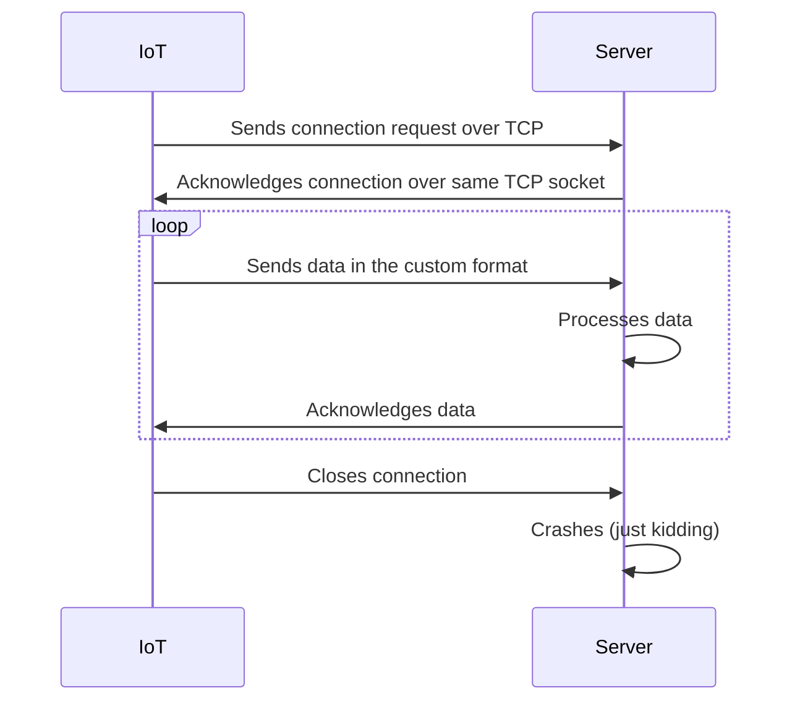

In the recent weeks, I had a chance to work on a web server project that I need to go through a bit lower level than usual.
Usually, our web servers serve "modern" RESTful APIs, and occasionally some other cool sounding protocols like GraphQL, gRPC or WebSockets.

There are so many frameworks and built-in
supports for that handles more or less everything for you.
With Java Spring, it is, practically, 
as simple as writing a Class annotated with `@RestController` 
and writing a method with `@GetMapping` or `@PostMapping` annotations 
to serve a RESTful API.

In Go it is just writing [this](https://github.com/kucukaslan/go-network/blob/96c5a1369fcfe7ee6281d86f75815acede70deb4/bare/main.go#L10-L15)[^imports]
```go
func main() {
	http.Handle("/bare", http.HandlerFunc(func(w http.ResponseWriter, r *http.Request) {
		fmt.Fprintf(w, "Hello, %q", html.EscapeString(r.URL.Path))
	}))
	log.Fatal(http.ListenAndServe("", nil))
}
```
no libraries, no frameworks, no annotations, no nothing.
[^imports]: ps. imports are added automatically by the IDEs even by the text editors like VSCode (via Plugins 🤞🏻).

But, in this project, we needed to serve some IoT devices using custom communication protocols.
Luckily[^ehem] there were no _official_ drivers whatsoever for them.
Only me and the reference manual 😋.

[^ehem]: I pronounce that word as [/ʌnˈfɔːr.tʃən.ət.li/](https://letmegooglethat.com/?q=%22%2F%CA%8Cn%CB%88f%C9%94%CB%90r.t%CA%83%C9%99n.%C9%99t.li%2F%22) to my manager

Don't get too excited though, we did not fall below the safe hills of TCP, yet.
The simplified architecture of the system is as follows:


In short I couldn't use any of the fancy libraries or frameworks 
as I needed to process the raw data coming from the IoT devices.

So I started listening to the TCP socket and reading the data. 
Roughly (omitted `if err != nil` checks for brevity[^err-nil]):
[^err-nil]: or maybe because I hate it 🤫
```go
func main() {
    listener, _ := net.Listen("tcp", ":8080")
    for {
    conn, _ := listener.Accept()
    go func (c net.Conn) {
    // read & process data and respond
    }(conn)
    }
}
```

It might not be so surprising (or exciting?) for you, 
but I realized that I could as well be reading an ordinary HTTP request
