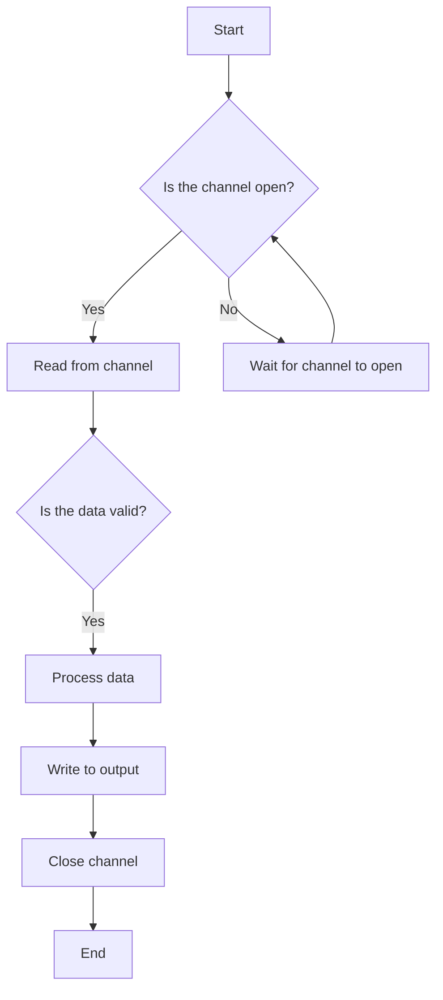

I had to write a batch processing job that downloads multiple files,
processes them separately using external services, 
and produces separate outputs for each file.

Ah the classical SIMD problem, I thought. \
We[^royal] are gonna have fun with all that *channel*s, *sync*s, *once.Do*s and *goroutine*s; I thought. \
But man[^person], was I wrong.

[^royal]: pluralis majestatis
[^person]: as in the [God gesceop ða æt fruman twegen _**men**_, wer and wif](https://en.wikipedia.org/wiki/Man_(word)) 

