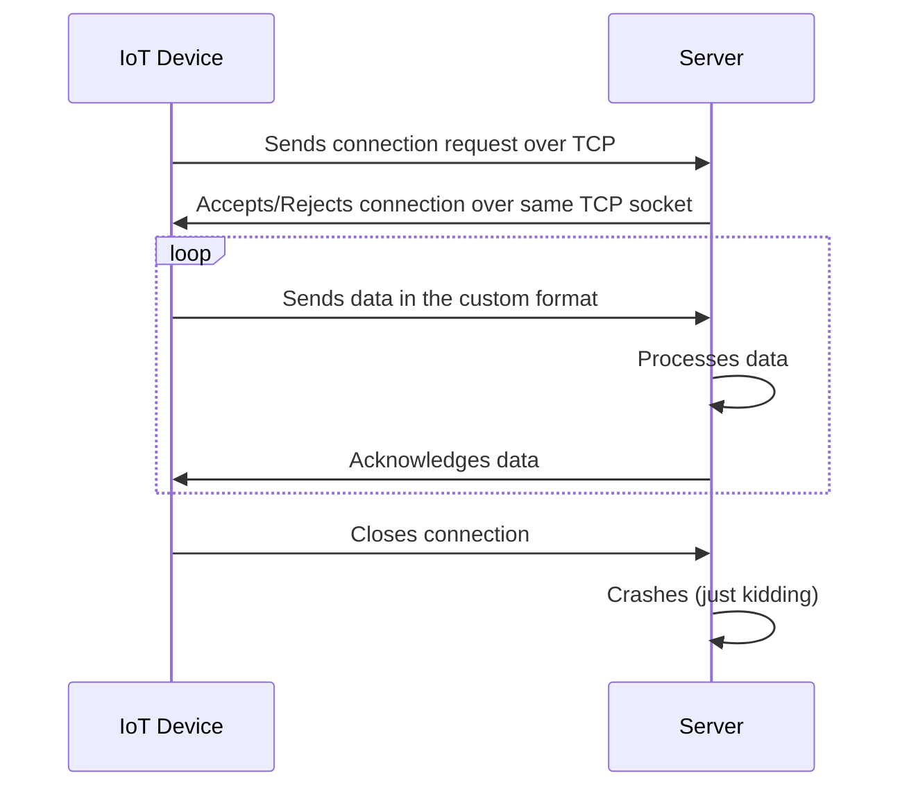
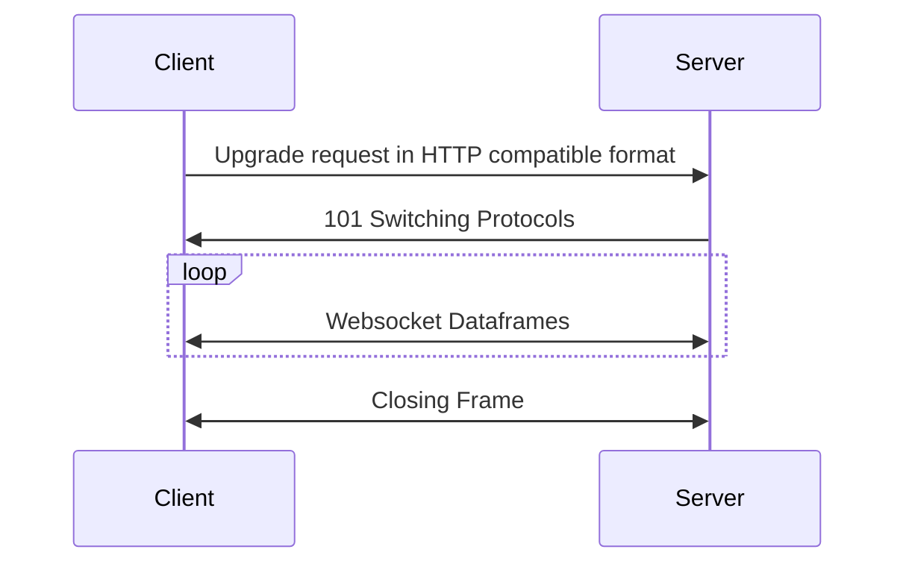

> **Draft Notice:**  
> This article is currently a draft. I welcome any and all feedback—especially harsh or critical comments—before its official release. \
> Please let me know what you think via muhammed@kucukaslan.com.tr! \
> Beware that I can deal with harsh comments, 
> but I expect you to tolerate if I reject some of your suggestions.

In the recent weeks, 
I had the chance to work on a web server project 
that I need to go through a bit lower level than usual.
Usually, our web servers serve "modern" RESTful APIs, 
and occasionally some other cool sounding protocols like GraphQL, gRPC or WebSockets.

## What Do We Usually Have
There are so many frameworks and built-in
supports for them that handles more or less everything for you.

With Java Spring, it is, practically, 
as simple as writing a Class annotated with `@RestController` 
and writing a method with `@GetMapping` or `@PostMapping` annotations 
to serve a RESTful API.

With Go, it is just writing [this](https://github.com/kucukaslan/go-network/blob/96c5a1369fcfe7ee6281d86f75815acede70deb4/bare/main.go#L10-L15)[^imports]
```go
func main() {
	http.Handle("/bare", http.HandlerFunc(func(w http.ResponseWriter, r *http.Request) {
		fmt.Fprintf(w, "Hello, %q", html.EscapeString(r.URL.Path))
	}))
	log.Fatal(http.ListenAndServe("", nil))
}
```
no libraries, no frameworks, no annotations, no nothing.
[^imports]: ps. imports are added automatically by the IDEs even by the text editors like VSCode (via Plugins 🤞🏻).

## What was Different This Time
But, in this project, we needed to serve some IoT devices using custom communication protocols.
Luckily[^ehem] there were no _official_ drivers whatsoever for them.
Only me and the reference manual 😋.

[^ehem]: I pronounced that word as [/ʌnˈfɔːr.tʃən.ət.li/](https://letmegooglethat.com/?q=%22%2F%CA%8Cn%CB%88f%C9%94%CB%90r.t%CA%83%C9%99n.%C9%99t.li%2F%22) to my manager

Don't get too excited though, we did not fall below the safe hills of TCP, yet.
The simplified architecture of the system is as follows:


In short, I couldn't use any of the fancy libraries or frameworks 
as I needed to process the raw data coming from the IoT devices.

So I started listening to the TCP socket and reading the data. 
Roughly like this (omitted `if err != nil` checks for brevity[^err-nil]):
[^err-nil]: or maybe because I hate it 🤫
```go
func main() {
    listener, _ := net.Listen("tcp", ":8080")
    for {
    conn, _ := listener.Accept()
    go func (c net.Conn) {
    // read & process data and respond
    }(conn)
    }
}
```

It might not be so surprising (or exciting?) for you, 
but as I was reading from the connection,
I realized that I could just as easily be reading an ordinary HTTP request.

## Listening to HTTP Requests
So, I decided to give it a try and see how a usual HTTP request looks like in the raw TCP socket.
I prototyped a simple RPL (Read Print Loop) program 
that merely reads the data from the TCP socket and prints it to the console.
See [github.com/kucukaslan/go-network/tree/main/rpl](https://github.com/kucukaslan/go-network/tree/main/rpl).

I ran the program and started sending HTTP requests:
```sh
curl http://localhost:8080/my/complex/path?with=query&params=1
```

And the output was:
```http request
GET /my/complex/path?with=query&params=1 HTTP/1.1
Host: localhost:8080
User-Agent: curl/8.7.1
Accept: */*

```
The first two lines contain the URL I used as well as the inferred request method: `GET`. 
That is something. 
Following lines appears to be the headers.

Let's make it a bit more complex by using another method and adding some headers:
```sh
curl -X POST \
     -H "Content-Type: application/json" \
     -H "My-Custom-Header: My-Custom-Value" \
     -d '{"key":"value "}' \
     http://localhost:8080/my/complex/path?with=query&params=1
```

and the new output has 'My-Custom-Header' header, different method and a body following the blank line:
```http request
POST /my/complex/path?with=query&params=1 HTTP/1.1
Host: localhost:8080
User-Agent: curl/8.7.1
Accept: */*
Content-Type: application/json
My-Custom-Header: My-Custom-Value
Content-Length: 16

{"key":"value"}
```

Let's try with a different type of body, using [Postman](https://www.postman.com/)
I issued a `POST` request with `form-data` body. With two key-value pair:
```dotenv
name=Muhammed
url=kucukaslan.com.tr
```
The server program printed:
```http request
POST /lolmol HTTP/1.1
User-Agent: PostmanRuntime/7.43.4
Accept: */*
Cache-Control: no-cache
Postman-Token: 30cb89d1-f2d8-41ae-9061-d4758c50d737
Host: localhost:8080
Accept-Encoding: gzip, deflate, br
Connection: keep-alive
Content-Type: multipart/form-data; boundary=--------------------------127929364679488579321066
Content-Length: 286

----------------------------127929364679488579321066
Content-Disposition: form-data; name="name"

Muhammed
----------------------------127929364679488579321066
Content-Disposition: form-data; name="url"

kucukaslan.com.tr
----------------------------127929364679488579321066--
```
Apparantly, `Content-Type` header defines some sort of separator, the `boundary`.
That boundary splits the body into multiple parts,
each of which starts with the `Content-Disposition` declaration
defining the data type and the name of the field. 
The value of that field is the content between blank line and the next boundary.

These examples must have given some idea about how the HTTP requests look like.
Obviously, there are more to it: compressions, encryptions, TLS etc. 

## Listening Other Common Protocols
It is time to test non-HTTP[^pedantic] requests such as WebSockets, gRPC, GraphQL, and even[^may] SOAP
[^pedantic]: non-RESTful if you are as pedantic as [the 20 year old proover](https://i.redd.it/1ef5ylxhmvx71.jpg).

[^may]: may Allah forgive me for uttering this word

### WebSockets
When I attempt to initiate a WebSocket connection, the RPL program prints:
```http request
GET / HTTP/1.1
Sec-WebSocket-Version: 13
Sec-WebSocket-Key: K601x1z6ko0266Ajx3QB5A==
Connection: Upgrade
Upgrade: websocket
Sec-WebSocket-Extensions: permessage-deflate; client_max_window_bits
Host: localhost:8080
```
this looks very similar to a usual HTTP request with some WebSocket specific headers.
However, the most crucial headers are the `Connection: Upgrade` and `Upgrade: websocket` headers.
These headers signal the server to switch the protocol from HTTP to WebSocket. 
If the server were to respond with `101 Switching Protocols` status code,
then the rest of the communication would be in the WebSocket protocol.


See [Upgrade - HTTP | MDN](https://developer.mozilla.org/en-US/docs/Web/HTTP/Reference/Headers/Upgrade)
for some more details on Upgrade.

See [RFC 2616 14.42 Upgrade](https://www.rfc-editor.org/rfc/rfc2616#section-14.42) for RFC documentation of Upgrade.

See [RFC 6455 - The WebSocket Protocol](https://datatracker.ietf.org/doc/html/rfc6455) for WebSocket protocol RFC,
and in particular [Section 5.2 - Data Framing](https://datatracker.ietf.org/doc/html/rfc6455#section-5.2) for the data frame format.

### gRPC
Trying this is a bit tricky since we need a `.proto` file to initiate the request.
I found [this](https://gist.githubusercontent.com/agreatfool/5e3a41052c6dd2f6d04b30901fc0269b/raw/b4e0f82f73843a79ecdbde31c1294952df3855c6/book.proto)
one on the wild and used it send the request.

After all the hard work (downloading random file from the internet and using it without checking),

This ugly thing was what I got:
```python
PRI * HTTP/2.0

SM

&=LMed@te�M�5�z���ȵG��tC\!\Vt&�Ը
```
You may have noticed that the first line still looks familiar except for the `PRI` method.
It turns out that HTTP/2 defines a new method called `PRI` which is used to initiate the connection.
Moreover, every HTTP/2 "connection preface starts with the string "`PRI *
HTTP/2.0\r\n\r\nSM\r\n\r\n`").  This sequence MUST be followed by a
SETTINGS frame ([Section 6.5](https://datatracker.ietf.org/doc/html/rfc7540#section-6.5))"[^http2-preface].
[^http2-preface]: [RFC 7540 - Hypertext Transfer Protocol Version 2 (HTTP/2)](https://datatracker.ietf.org/doc/html/rfc7540#section-3.5)

So the gibberish-like line was the so-called SETTINGS frame.

See [gRPC over HTTP2](https://github.com/grpc/grpc/blob/master/doc/PROTOCOL-HTTP2.md) for more details on gRPC protocol[^trust-me].
[^trust-me]: trust me this was the least beginner-friendly document I could find sorry for any convenience invoked.

See [RFC 7540 - Hypertext Transfer Protocol Version 2 (HTTP/2)](https://datatracker.ietf.org/doc/html/rfc7540#section-6.5) for more details on HTTP/2.

### GraphQL
This was similar to gRPC as it usually expects a scheme. I used [geeksforgeeks](https://www.geeksforgeeks.org/variables-in-graphql/)'
example query and received the following output:
```http request
POST / HTTP/1.1
accept: */*
content-type: application/json
user-agent: PostmanClient/11.44.6 (AppId=10ae2050-5bdb-4706-97c5-394d76d2ae59)
Host: localhost:8080
Content-Length: 167
Connection: keep-alive

{"query":"query GetPerson($id: ID!) {\n    person(id: $id) {\n        name\n        age\n        address\n    }\n}\n","operationName":"GetPerson","variables":{"id":7}}
```
It is quite similar to a usual HTTP request with a JSON body.
It seems, unlike gRPC and the WebSockets, 
it uses post request bodies as the communication medium instead of defining a new protocol.
I want to s**t talk about it, but I cannot even bother myself doing it as I don't really care.

See [spec.graphql.org/](https://spec.graphql.org/) for GraphQL specs.

See _Jens Neuse_'s [reflections on GraphQL](https://wundergraph.com/blog/six-year-graphql-recap). 

### Simple Object Access Protocol
This protocol, whose common name is intentionally not uttered, 
differs from previous ones by not depending on any specific application or transport layer.
I prefer not to have it used on my computer, 
so see the [wiki page](https://en.wikipedia.org/wiki/SOAP#Example_message_(encapsulated_in_HTTP)) 
for an example HTTP request over TCP.

## Before the End
In the HTTP examples I used `curl` to issue requests.
`curl` has a [--verbose](https://curl.se/docs/manpage.html#-v) flag that logs a lot of things, 
including the raw http requests. \
Moreover, it also logs DNS resolutions, TLS handshakes etc. \
So, I could've used it all this time instead of writing a Read Print Loop,
but it wouldn't have been as much fun.
Try the `--verbose` flag yourself:
```shell
curl --verbose https://kucukaslan.com.tr
```


## Last words
As a side benefit of working on an IoT protocol, 
we had a chance to unbox some of the common communication protocols.
We recognized the structure of HTTP requests,
use of the Upgrade header for WebSockets,
the HTTP/2 preface for gRPC etc.

I intend to write a follow-up article focusing on the HTTP Request Message format
alongside the corresponding RFC documents. But no promises.
