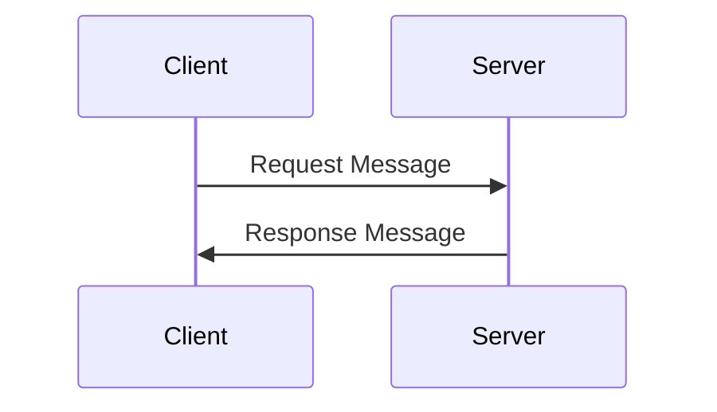

> **Draft Notice:**  
> This article is currently a draft. I welcome any and all feedback—especially harsh or critical comments—before its official release. \
> Please let me know what you think via muhammed@kucukaslan.com.tr! \
> Beware that I can deal with harsh comments,
> but I expect you to tolerate if I reject some of your suggestions.


In the previous article, we informally examined the structure of various communication
protocols over TCP such as HTTP, gRPC, and WebSocket.

In the end of the article, I promised to examine the HTTP
request message specification more formally.
As I examined the specs I could not resist the urge to prototype a (partial) parser for it.

[//]: # (TODO Make an 'adam akilli' explanation of how I will explain the Grammar of HTTP Request Message)
Preliminary note: I used https://diagon.arthursonzogni.com/#Grammar to visualize the ABNF grammar definitions 

## Formal Specifications of Internet Standards and HTTP
In the ol' good days, internet standards were designed and discussed with
'[Request for Comments](https://www.ietf.org/process/rfcs/)' (RFC) documents.

New standard were proposed as RFCs, and after a period of discussion and review,
and if there is consensus, they become an official standard that is used by
absolute reference document for that standard.

The HTTP protocol is defined, updated, revised, and extended in a series of RFCs.
As of the writing of this article, RFC 9110 and RFC 9112 are 
the current Internet Standards for HTTP (as far as this article is concerned [^context]):
- [RFC 9110](https://www.rfc-editor.org/rfc/rfc9110) - HTTP Semantics
- [RFC 9112](https://www.rfc-editor.org/rfc/rfc9112) - HTTP/1.1

These documents uses [ABNF](https://www.rfc-editor.org/rfc/rfc5234)
(Augmented Backus-Naur Form) to define the grammar of HTTP messages.

[^context]: obviously, there are other RFCs that define other aspects of HTTP,
RFC 911**1** is blatantly obvious correct guess that is related to HTTP as well.

## HTTP Standard
The HTTP standard includes all aspects of the protocol, including how the transport layer
connection is established, state (?) and cache management, encryption, as well as the message format.

HTTP communications are based on a request-response model, 
where the client sends a request message,
and the server responds with a response message and the communication is completed:

Each request-response pair is (theoretically) independent of each other.
Depending on your definition of independence, they might be counted independent practically as well.

Aforementioned RFCs defines the format of the HTTP request and response messages
using ABNF (Augmented Backus-Naur Form) grammar in addition to
the plain description and details. If you are not familiar with ABNF 
but know regular expressions, you can think of it as ABNF as 
an improved version of regular expressions that has variables, recursion etc.

A quick look at a few examples will be sufficient to make sense of the 
HTTP definition excerpts that I will take into this article. 
You can check out [this](https://g.co/gemini/share/e2d11e0f4f7e), if you don't know where to start. 

## HTTP Message Format with ABNF and Diagrams
Both of the request and response messages must conform to the `HTTP-message` defined as[^abnf]

[^abnf]: Collected ABNF definitions for the HTTP/1.1 message format are defined at
[Appendix A. Collected ABNF](https://www.rfc-editor.org/rfc/rfc9112.html#name-collected-abnf) of RFC 9112
and for the (general) HTTP Semantics are defined at 
[Appendix A. Collected ABNF](https://www.rfc-editor.org/rfc/rfc9110.html#name-collected-abnf) of RFC 9110.
We are interested in the message format, so the former is more relevant to us.

```abnf
  HTTP-message   = start-line CRLF
                   *( field-line CRLF )
                   CRLF
                   [ message-body ]
```

First, I want to call out the elephant in the room:
Yes it is the same `CRLF` used for new lines, check 
[RFC 5234 Appendix B.  Core ABNF of ABNF](https://www.rfc-editor.org/rfc/rfc5234#appendix-B.1)
if you want to "make your own research", instead of taking my word for it.

If you prefer a state diagram (visual, colorful, cool), instead of ABNF (text, plain, boring) here you go:

 <section>
  <h2><a name='HTTP-message'>HTTP-message:</a></h2>
  <svg height='85' width='600'>
    <path d='M5.5 34 v12 m 4 0 v-12' class='station'/>
    <path d='M590.5 34 v12 m 4 0 v-12' class='station'/>
    <a href='#start-line'>
    <rect x='30' y='30' height='20' width='90' rx='0' ry='0' class='rule'/>
    <text x='75' y='45' text-anchor='middle' class='rule'>start-line</text>
    </a>
    <a href='#CRLF'>
    <rect x='190' y='30' height='20' width='50' rx='0' ry='0' class='rule'/>
    <text x='215' y='45' text-anchor='middle' class='rule'>CRLF</text>
    </a>
    <a href='#field-line'>
    <rect x='170' y='60' height='20' width='90' rx='0' ry='0' class='rule'/>
    <text x='215' y='75' text-anchor='middle' class='rule'>field-line</text>
    </a>
    <a href='#CRLF'>
    <rect x='310' y='30' height='20' width='50' rx='0' ry='0' class='rule'/>
    <text x='335' y='45' text-anchor='middle' class='rule'>CRLF</text>
    </a>
    <path d='M477 10 l-4 3 v-6 z' class='arrow'/>
    <rect x='410' y='30' height='20' width='130' rx='0' ry='0' class='rule'/>
    <text x='475' y='45' text-anchor='middle' class='rule'>message-body</text>
    <path d='M390 20 v10'/>
    <path d='M560 30 q0 10 10 10'/>
    <path d='M540 40 h50'/>
    <path d='M380 40 q10 0 10 -10'/>
    <path d='M390 20 q0 -10 10 -10 h150 q10 0 10 10 v10'/>
    <path d='M360 40 h50'/>
    <path d='M150 50 v10 q0 10 10 10 h10'/>
    <path d='M260 70 h10 q10 0 10 -10'/>
    <path d='M270 40 q10 0 10 10 v10'/>
    <path d='M240 40 h70'/>
    <path d='M150 50 q0 -10 10 -10'/>
    <path d='M120 40 h70'/>
    <path d='M10 40 h20'/>
  </svg>
 </section>

So the HTTP-message is defined as a `start-line` followed by a new line,  
followed by optional and potentially multiple `field-line`s, each followed by a new line,  
followed by yet another new line, and finally an optional `message-body`.  
I bet this did not help at all :smirk:.
In the previous article, we had examined some sample HTTP request messages such as 
```http
GET /hello HTTP/1.1
Host: localhost:8080
User-Agent: curl/8.7.1
Accept: */*
```
we also made the observation that the HTTP requests starts with a line
consist of method (`Get`), path (`/hello`), http version (`HTTP/1.1`),
and followed by multiple lines of headers such as `Host`, `User-Agent`, and `Accept`.

So as you may've guessed already `start-line` is the 
one that starts with the method, path, and version, 
and `field-line` is the header key-value pairs.
message-body is the body of the request (DUH!) if it exists!

Let's continue with the definition of the `start-line`:
```abnf
  start-line     = request-line / status-line
```
Remember that an HTTP message can be either a request or a response.
For requests, the `start-line` is a `request-line`, and for responses, it is a `status-line`.
Their respective definitions are:
```abnf
  request-line   = method SP request-target SP HTTP-version
  status-line = HTTP-version SP status-code SP [ reason-phrase ]
```
The `request-line` starts with the `method`, followed by a space (`SP`), 
then the `request-target`, another space, and finally the `HTTP-version`.

Let's go deeper into the `request-line` definition:
`method` is defined as:
```abnf
  method         = token
``` 

where `token` is defined as:
```abnf
tchar = "!" / "#" / "$" / "%" / "&" / "'" / "*" / "+" / "-" / "." /
 "^" / "_" / "`" / "|" / "~" / DIGIT / ALPHA
token = 1*tchar
```
so `method` can theoretically be quite arbitrary, but in practice, 
there are a finite set of methods as defined in the [RFC 9110](https://www.rfc-editor.org/rfc/rfc9110#name-overview):

|Method Name|Description|Section|
|---|---|---|
|GET|Transfer a current representation of the target resource.|9.3.1|
|HEAD|Same as GET, but do not transfer the response content.|9.3.2|
|POST|Perform resource-specific processing on the request content.|9.3.3|
|PUT|Replace all current representations of the target resource with the request content.|9.3.4|
|DELETE|Remove all current representations of the target resource.|9.3.5|
|CONNECT|Establish a tunnel to the server identified by the target resource.|9.3.6|
|OPTIONS|Describe the communication options for the target resource.|9.3.7|
|TRACE|Perform a message loop-back test along the path to the target resource.|9.3.8|

If it made you disappointed and angry, you would be happy to know that
it is possible to register new methods with IANA, just follow the procedure defined in
[16.1.1. Method Registry](https://www.rfc-editor.org/rfc/rfc9110#name-method-registry).  
See [IANA HTTP Method Registry](https://www.iana.org/assignments/http-methods/http-methods.xhtml)
for an up-to-date list.

So we get[^pun] where the `GET` in the `GET /hello HTTP/1.1` comes from!
[^pun]: pun is intended unless you didn't laugh, in which case no pun intended.

 <section>
  <h2><a name='start-line'>start-line:</a></h2>
  <svg height='65' width='230'>
    <path d='M5.5 14 v12 m 4 0 v-12' class='station'/>
    <path d='M220.5 14 v12 m 4 0 v-12' class='station'/>
    <a href='#request-line'>
    <rect x='60' y='10' height='20' width='110' rx='0' ry='0' class='rule'/>
    <text x='115' y='25' text-anchor='middle' class='rule'>request-line</text>
    </a>
    <a href='#status-line'>
    <rect x='70' y='40' height='20' width='90' rx='0' ry='0' class='rule'/>
    <text x='115' y='55' text-anchor='middle' class='rule'>status-line</text>
    </a>
    <path d='M190 30 v10'/>
    <path d='M160 50 h20 q10 0 10 -10'/>
    <path d='M40 40 q0 10 10 10 h20'/>
    <path d='M190 30 q0 -10 10 -10'/>
    <path d='M170 20 h50'/>
    <path d='M30 20 q10 0 10 10 v10'/>
    <path d='M10 20 h50'/>
  </svg>
 </section>

 <section>
  <h2><a name='field-line'>field-line:</a></h2>
  <svg height='35' width='440'>
    <path d='M5.5 14 v12 m 4 0 v-12' class='station'/>
    <path d='M430.5 14 v12 m 4 0 v-12' class='station'/>
    <rect x='30' y='10' height='20' width='90' rx='0' ry='0' class='rule'/>
    <text x='75' y='25' text-anchor='middle' class='rule'>field-name</text>
    <rect x='140' y='10' height='20' width='20' rx='8' ry='8' class='literal'/>
    <text x='150' y='25' text-anchor='middle' class='literal'>:</text>
    <rect x='180' y='10' height='20' width='50' rx='0' ry='0' class='rule'/>
    <text x='205' y='25' text-anchor='middle' class='rule'>OWS</text>
    <rect x='250' y='10' height='20' width='90' rx='0' ry='0' class='rule'/>
    <text x='295' y='25' text-anchor='middle' class='rule'>field-value</text>
    <rect x='360' y='10' height='20' width='50' rx='0' ry='0' class='rule'/>
    <text x='385' y='25' text-anchor='middle' class='rule'>OWS</text>
    <path d='M340 20 h20'/>
    <path d='M230 20 h20'/>
    <path d='M160 20 h20'/>
    <path d='M120 20 h20'/>
    <path d='M410 20 h20'/>
    <path d='M10 20 h20'/>
  </svg>
 </section>

 <section>
  <h2><a name='request-line'>request-line:</a></h2>
  <svg height='35' width='550'>
    <path d='M5.5 14 v12 m 4 0 v-12' class='station'/>
    <path d='M540.5 14 v12 m 4 0 v-12' class='station'/>
    <a href='#method'>
    <rect x='30' y='10' height='20' width='70' rx='0' ry='0' class='rule'/>
    <text x='65' y='25' text-anchor='middle' class='rule'>method</text>
    </a>
    <rect x='120' y='10' height='20' width='50' rx='0' ry='0' class='rule'/>
    <text x='145' y='25' text-anchor='middle' class='rule'>SP</text>
    <a href='#request-target'>
    <rect x='190' y='10' height='20' width='130' rx='0' ry='0' class='rule'/>
    <text x='255' y='25' text-anchor='middle' class='rule'>request-target</text>
    </a>
    <rect x='340' y='10' height='20' width='50' rx='0' ry='0' class='rule'/>
    <text x='365' y='25' text-anchor='middle' class='rule'>SP</text>
    <a href='#HTTP-version'>
    <rect x='410' y='10' height='20' width='110' rx='0' ry='0' class='rule'/>
    <text x='465' y='25' text-anchor='middle' class='rule'>HTTP-version</text>
    </a>
    <path d='M390 20 h20'/>
    <path d='M320 20 h20'/>
    <path d='M170 20 h20'/>
    <path d='M100 20 h20'/>
    <path d='M520 20 h20'/>
    <path d='M10 20 h20'/>
  </svg>
 </section>

 <section>
  <h2><a name='status-line'>status-line:</a></h2>
  <svg height='55' width='650'>
    <path d='M5.5 34 v12 m 4 0 v-12' class='station'/>
    <path d='M640.5 34 v12 m 4 0 v-12' class='station'/>
    <a href='#HTTP-version'>
    <rect x='30' y='30' height='20' width='110' rx='0' ry='0' class='rule'/>
    <text x='85' y='45' text-anchor='middle' class='rule'>HTTP-version</text>
    </a>
    <rect x='160' y='30' height='20' width='50' rx='0' ry='0' class='rule'/>
    <text x='185' y='45' text-anchor='middle' class='rule'>SP</text>
    <rect x='230' y='30' height='20' width='110' rx='0' ry='0' class='rule'/>
    <text x='285' y='45' text-anchor='middle' class='rule'>status-code</text>
    <rect x='360' y='30' height='20' width='50' rx='0' ry='0' class='rule'/>
    <text x='385' y='45' text-anchor='middle' class='rule'>SP</text>
    <path d='M527 10 l-4 3 v-6 z' class='arrow'/>
    <rect x='460' y='30' height='20' width='130' rx='0' ry='0' class='rule'/>
    <text x='525' y='45' text-anchor='middle' class='rule'>reason-phrase</text>
    <path d='M440 20 v10'/>
    <path d='M610 30 q0 10 10 10'/>
    <path d='M590 40 h50'/>
    <path d='M430 40 q10 0 10 -10'/>
    <path d='M440 20 q0 -10 10 -10 h150 q10 0 10 10 v10'/>
    <path d='M410 40 h50'/>
    <path d='M340 40 h20'/>
    <path d='M210 40 h20'/>
    <path d='M140 40 h20'/>
    <path d='M10 40 h20'/>
  </svg>
 </section>

 <section>
  <h2><a name='method'>method:</a></h2>
  <svg height='35' width='110'>
    <path d='M5.5 14 v12 m 4 0 v-12' class='station'/>
    <path d='M100.5 14 v12 m 4 0 v-12' class='station'/>
    <a href='#token'>
    <rect x='30' y='10' height='20' width='50' rx='0' ry='0' class='rule'/>
    <text x='55' y='25' text-anchor='middle' class='rule'>token</text>
    </a>
    <path d='M80 20 h20'/>
    <path d='M10 20 h20'/>
  </svg>
 </section>

 <section>
  <h2><a name='tchar'>tchar:</a></h2>
  <svg height='435' width='190'>
    <path d='M5.5 14 v12 m 4 0 v-12' class='station'/>
    <path d='M180.5 14 v12 m 4 0 v-12' class='station'/>
    <rect x='85' y='10' height='20' width='20' rx='8' ry='8' class='literal'/>
    <text x='95' y='25' text-anchor='middle' class='literal'>!</text>
    <rect x='85' y='40' height='20' width='20' rx='8' ry='8' class='literal'/>
    <text x='95' y='55' text-anchor='middle' class='literal'>#</text>
    <line x1='95' y1='65' x2='95' y2='75' class='ellipsis'/>    <rect x='85' y='80' height='20' width='20' rx='8' ry='8' class='literal'/>
    <text x='95' y='95' text-anchor='middle' class='literal'>'</text>
    <rect x='85' y='110' height='20' width='20' rx='8' ry='8' class='literal'/>
    <text x='95' y='125' text-anchor='middle' class='literal'>*</text>
    <rect x='85' y='140' height='20' width='20' rx='8' ry='8' class='literal'/>
    <text x='95' y='155' text-anchor='middle' class='literal'>+</text>
    <rect x='85' y='170' height='20' width='20' rx='8' ry='8' class='literal'/>
    <text x='95' y='185' text-anchor='middle' class='literal'>-</text>
    <rect x='85' y='200' height='20' width='20' rx='8' ry='8' class='literal'/>
    <text x='95' y='215' text-anchor='middle' class='literal'>.</text>
    <rect x='85' y='230' height='20' width='20' rx='8' ry='8' class='literal'/>
    <text x='95' y='245' text-anchor='middle' class='literal'>^</text>
    <rect x='85' y='260' height='20' width='20' rx='8' ry='8' class='literal'/>
    <text x='95' y='275' text-anchor='middle' class='literal'>_</text>
    <rect x='85' y='290' height='20' width='20' rx='8' ry='8' class='literal'/>
    <text x='95' y='305' text-anchor='middle' class='literal'>`</text>
    <rect x='85' y='320' height='20' width='20' rx='8' ry='8' class='literal'/>
    <text x='95' y='335' text-anchor='middle' class='literal'>|</text>
    <rect x='85' y='350' height='20' width='20' rx='8' ry='8' class='literal'/>
    <text x='95' y='365' text-anchor='middle' class='literal'>~</text>
    <rect x='60' y='380' height='20' width='70' rx='0' ry='0' class='rule'/>
    <text x='95' y='395' text-anchor='middle' class='rule'>DIGIT</text>
    <rect x='60' y='410' height='20' width='70' rx='0' ry='0' class='rule'/>
    <text x='95' y='425' text-anchor='middle' class='rule'>ALPHA</text>
    <path d='M150 30 v380'/>
    <path d='M130 420 h10 q10 0 10 -10'/>
    <path d='M40 410 q0 10 10 10 h10'/>
    <path d='M130 390 h10 q10 0 10 -10'/>
    <path d='M40 380 q0 10 10 10 h10'/>
    <path d='M105 360 h35 q10 0 10 -10'/>
    <path d='M40 350 q0 10 10 10 h35'/>
    <path d='M105 330 h35 q10 0 10 -10'/>
    <path d='M40 320 q0 10 10 10 h35'/>
    <path d='M105 300 h35 q10 0 10 -10'/>
    <path d='M40 290 q0 10 10 10 h35'/>
    <path d='M105 270 h35 q10 0 10 -10'/>
    <path d='M40 260 q0 10 10 10 h35'/>
    <path d='M105 240 h35 q10 0 10 -10'/>
    <path d='M40 230 q0 10 10 10 h35'/>
    <path d='M105 210 h35 q10 0 10 -10'/>
    <path d='M40 200 q0 10 10 10 h35'/>
    <path d='M105 180 h35 q10 0 10 -10'/>
    <path d='M40 170 q0 10 10 10 h35'/>
    <path d='M105 150 h35 q10 0 10 -10'/>
    <path d='M40 140 q0 10 10 10 h35'/>
    <path d='M105 120 h35 q10 0 10 -10'/>
    <path d='M40 110 q0 10 10 10 h35'/>
    <path d='M105 90 h35 q10 0 10 -10'/>
    <path d='M40 80 q0 10 10 10 h35'/>
    <path d='M105 50 h35 q10 0 10 -10'/>
    <path d='M40 40 q0 10 10 10 h35'/>
    <path d='M150 30 q0 -10 10 -10'/>
    <path d='M105 20 h75'/>
    <path d='M30 20 q10 0 10 10 v380'/>
    <path d='M10 20 h75'/>
  </svg>
 </section>

 <section>
  <h2><a name='token'>token:</a></h2>
  <svg height='55' width='170'>
    <path d='M5.5 14 v12 m 4 0 v-12' class='station'/>
    <path d='M160.5 14 v12 m 4 0 v-12' class='station'/>
    <a href='#tchar'>
    <rect x='60' y='10' height='20' width='50' rx='0' ry='0' class='rule'/>
    <text x='85' y='25' text-anchor='middle' class='rule'>tchar</text>
    </a>
    <path d='M83 40 l4 3 v-6 z' class='arrow'/>
    <path d='M40 30 v0 q0 10 10 10 h70 q10 0 10 -10 v0'/>
    <path d='M120 20 q10 0 10 10'/>
    <path d='M110 20 h50'/>
    <path d='M40 30 q0 -10 10 -10'/>
    <path d='M10 20 h50'/>
  </svg>
 </section>

 <section>
  <h2><a name='request-target'>request-target:</a></h2>
  <svg height='125' width='250'>
    <path d='M5.5 14 v12 m 4 0 v-12' class='station'/>
    <path d='M240.5 14 v12 m 4 0 v-12' class='station'/>
    <a href='#origin-form'>
    <rect x='70' y='10' height='20' width='110' rx='0' ry='0' class='rule'/>
    <text x='125' y='25' text-anchor='middle' class='rule'>origin-form</text>
    </a>
    <a href='#absolute-form'>
    <rect x='70' y='40' height='20' width='110' rx='0' ry='0' class='rule'/>
    <text x='125' y='55' text-anchor='middle' class='rule'>absolute-form</text>
    </a>
    <a href='#authority-form'>
    <rect x='60' y='70' height='20' width='130' rx='0' ry='0' class='rule'/>
    <text x='125' y='85' text-anchor='middle' class='rule'>authority-form</text>
    </a>
    <a href='#asterisk-form'>
    <rect x='70' y='100' height='20' width='110' rx='0' ry='0' class='rule'/>
    <text x='125' y='115' text-anchor='middle' class='rule'>asterisk-form</text>
    </a>
    <path d='M210 30 v70'/>
    <path d='M180 110 h20 q10 0 10 -10'/>
    <path d='M40 100 q0 10 10 10 h20'/>
    <path d='M190 80 h10 q10 0 10 -10'/>
    <path d='M40 70 q0 10 10 10 h10'/>
    <path d='M180 50 h20 q10 0 10 -10'/>
    <path d='M40 40 q0 10 10 10 h20'/>
    <path d='M210 30 q0 -10 10 -10'/>
    <path d='M180 20 h60'/>
    <path d='M30 20 q10 0 10 10 v70'/>
    <path d='M10 20 h60'/>
  </svg>
 </section>

 <section>
  <h2><a name='origin-form'>origin-form:</a></h2>
  <svg height='55' width='340'>
    <path d='M5.5 34 v12 m 4 0 v-12' class='station'/>
    <path d='M330.5 34 v12 m 4 0 v-12' class='station'/>
    <rect x='30' y='30' height='20' width='110' rx='0' ry='0' class='rule'/>
    <text x='85' y='45' text-anchor='middle' class='rule'>absolute-path</text>
    <path d='M237 10 l-4 3 v-6 z' class='arrow'/>
    <rect x='190' y='30' height='20' width='20' rx='8' ry='8' class='literal'/>
    <text x='200' y='45' text-anchor='middle' class='literal'>?</text>
    <rect x='230' y='30' height='20' width='50' rx='0' ry='0' class='rule'/>
    <text x='255' y='45' text-anchor='middle' class='rule'>query</text>
    <path d='M170 20 v10'/>
    <path d='M300 30 q0 10 10 10'/>
    <path d='M280 40 h50'/>
    <path d='M210 40 h20'/>
    <path d='M160 40 q10 0 10 -10'/>
    <path d='M170 20 q0 -10 10 -10 h110 q10 0 10 10 v10'/>
    <path d='M140 40 h50'/>
    <path d='M10 40 h20'/>
  </svg>
 </section>

 <section>
  <h2><a name='absolute-form'>absolute-form:</a></h2>
  <svg height='35' width='170'>
    <path d='M5.5 14 v12 m 4 0 v-12' class='station'/>
    <path d='M160.5 14 v12 m 4 0 v-12' class='station'/>
    <rect x='30' y='10' height='20' width='110' rx='0' ry='0' class='rule'/>
    <text x='85' y='25' text-anchor='middle' class='rule'>absolute-URI</text>
    <path d='M140 20 h20'/>
    <path d='M10 20 h20'/>
  </svg>
 </section>

 <section>
  <h2><a name='authority-form'>authority-form:</a></h2>
  <svg height='35' width='240'>
    <path d='M5.5 14 v12 m 4 0 v-12' class='station'/>
    <path d='M230.5 14 v12 m 4 0 v-12' class='station'/>
    <rect x='30' y='10' height='20' width='70' rx='0' ry='0' class='rule'/>
    <text x='65' y='25' text-anchor='middle' class='rule'>uri-host</text>
    <rect x='120' y='10' height='20' width='20' rx='8' ry='8' class='literal'/>
    <text x='130' y='25' text-anchor='middle' class='literal'>:</text>
    <rect x='160' y='10' height='20' width='50' rx='0' ry='0' class='rule'/>
    <text x='185' y='25' text-anchor='middle' class='rule'>port</text>
    <path d='M140 20 h20'/>
    <path d='M100 20 h20'/>
    <path d='M210 20 h20'/>
    <path d='M10 20 h20'/>
  </svg>
 </section>

 <section>
  <h2><a name='asterisk-form'>asterisk-form:</a></h2>
  <svg height='35' width='80'>
    <path d='M5.5 14 v12 m 4 0 v-12' class='station'/>
    <path d='M70.5 14 v12 m 4 0 v-12' class='station'/>
    <rect x='30' y='10' height='20' width='20' rx='8' ry='8' class='literal'/>
    <text x='40' y='25' text-anchor='middle' class='literal'>*</text>
    <path d='M50 20 h20'/>
    <path d='M10 20 h20'/>
  </svg>
 </section>

 <section>
  <h2><a name='HTTP-version'>HTTP-version:</a></h2>
  <svg height='35' width='410'>
    <path d='M5.5 14 v12 m 4 0 v-12' class='station'/>
    <path d='M400.5 14 v12 m 4 0 v-12' class='station'/>
    <a href='#HTTP-name'>
    <rect x='30' y='10' height='20' width='90' rx='0' ry='0' class='rule'/>
    <text x='75' y='25' text-anchor='middle' class='rule'>HTTP-name</text>
    </a>
    <rect x='140' y='10' height='20' width='20' rx='8' ry='8' class='literal'/>
    <text x='150' y='25' text-anchor='middle' class='literal'>/</text>
    <rect x='180' y='10' height='20' width='70' rx='0' ry='0' class='rule'/>
    <text x='215' y='25' text-anchor='middle' class='rule'>DIGIT</text>
    <rect x='270' y='10' height='20' width='20' rx='8' ry='8' class='literal'/>
    <text x='280' y='25' text-anchor='middle' class='literal'>.</text>
    <rect x='310' y='10' height='20' width='70' rx='0' ry='0' class='rule'/>
    <text x='345' y='25' text-anchor='middle' class='rule'>DIGIT</text>
    <path d='M290 20 h20'/>
    <path d='M250 20 h20'/>
    <path d='M160 20 h20'/>
    <path d='M120 20 h20'/>
    <path d='M380 20 h20'/>
    <path d='M10 20 h20'/>
  </svg>
 </section>

 <section>
  <h2><a name='HTTP-name'>HTTP-name:</a></h2>
  <svg height='35' width='110'>
    <path d='M5.5 14 v12 m 4 0 v-12' class='station'/>
    <path d='M100.5 14 v12 m 4 0 v-12' class='station'/>
    <rect x='30' y='10' height='20' width='50' rx='8' ry='8' class='literal'/>
    <text x='55' y='25' text-anchor='middle' class='literal'>HTTP</text>
    <path d='M80 20 h20'/>
    <path d='M10 20 h20'/>
  </svg>
 </section>

 <section>
  <h2><a name='CRLF'>CRLF:</a></h2>
  <svg height='35' width='160'>
    <path d='M5.5 14 v12 m 4 0 v-12' class='station'/>
    <path d='M150.5 14 v12 m 4 0 v-12' class='station'/>
    <rect x='30' y='10' height='20' width='50' rx='0' ry='0' class='rule'/>
    <text x='55' y='25' text-anchor='middle' class='rule'>CR</text>
    <rect x='100' y='10' height='20' width='30' rx='0' ry='0' class='rule'/>
    <text x='115' y='25' text-anchor='middle' class='rule'>LF</text>
    <path d='M80 20 h20'/>
    <path d='M130 20 h20'/>
    <path d='M10 20 h20'/>
  </svg>
 </section>


#


  <style>
      rect, line, path { stroke-width: 1.5px; stroke: black; fill: transparent; }
      rect, line, path { stroke-linecap: square; stroke-linejoin: round; }
      path { fill: transparent; }
      text.literal { font-family: monospace; }
      a { fill: blue; }
      a:hover rect { fill: aliceblue; }
      h2 { font-size: inherit; font-weight: inherit; }
      line.ellipsis { stroke-dasharray: 1 3.5; }
      tspan.hex { font-family: monospace; font-size: 90%; }
      path.arrow { fill: black; }
      svg { margin-left: 30px; }
  </style>
